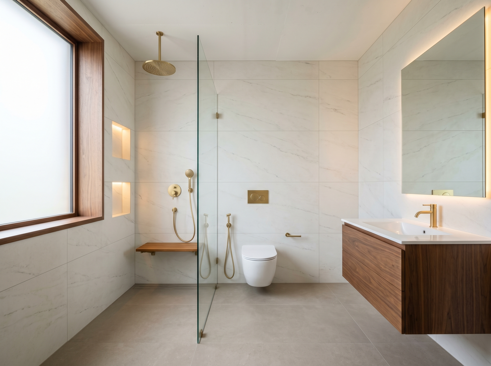

# GF Common Bathroom — Interior Design

**Room:** Ground Floor Common Bathroom
**Dimensions:** 9'0" (N–S length) × 4'6" (E–W width)
**Ceiling height:** 8ft — attic sits directly above the lintel; no false ceiling possible
**Door:** East wall, left corner, 2.5ft wide, swings inward to the left
**Style:** Light Luxury Spa — warm off-white, wood, brushed gold

---

## Render



*Generated 2026-05-01 — v3, SE-corner perspective, correct fixture sequence — accepted*

> **Render note:** The window appears on the side wall in the render due to AI perspective limitations. It is correctly specified as the **west end wall** in the layout below. Contractor to follow the layout, not the render image.

---

## Spatial Layout (Plan View)

```
         WEST WALL (4'6") — 3ft frosted window
         ┌────[  window  ]────┐
         │                    │
N        │  ← SHOWER (wet) →  │        S
O  ══════╪══ glass partition ══╪══════  O
R        │  ← COMMODE (dry) → │        U
T        │                    │        T
H        │  ← VANITY+BASIN →  │        H
(9ft)    │                    │  (9ft)
         └────────────────────┘
              EAST WALL (4'6")
              [DOOR — left corner, 2.5ft]
```

**Reading the room on entry (door swings left, you step in facing west):**
- Directly ahead and to the right (north wall): Vanity → Commode → Glass partition → Shower
- To your right (south wall): Plain in the dry zone; storage niches + teak bench in the shower zone
- Straight ahead at the far end (west wall): 3ft × 4ft frosted window — floods the shower with diffused natural light
- Above: Bare 8ft RCC ceiling (no false ceiling — attic sits on the lintel)

---

## Zone Breakdown

### Zone A — Vanity (east end, north wall)
- Floating walnut-finish cabinet, 600mm wide × 450mm deep, mounted at 450mm from floor
- 550mm white ceramic undermount basin
- Brushed gold single-lever deck-mount faucet
- Frameless LED backlit mirror above, 600mm W × 800mm H, warm 3000K
- Mirror mounted at 1.2m from floor to bottom edge (centre of mirror at eye level)
- Soft-close drawer(s) in cabinet for toiletries

### Zone B — Commode (dry zone, north wall)
- Wall-hung western WC, white, with soft-close seat
- In-wall concealed cistern flush plate — brushed gold
- Toilet paper holder on south wall at 700mm height: brushed gold
- Towel bar 600mm, brushed gold, on south wall at 1.2m height (within reach from WC)

### Zone C — Glass Partition
- Frameless clear toughened glass, 10mm thick
- Floor-to-ceiling height: full 8ft panel or 2.1m (leaving top open to allow steam ventilation)
- Frameless single glass door with brushed gold pivot/handle — or fixed panel + step-over threshold
- **Recommend:** Fixed panel (no door) with a 200mm raised threshold (kerb) between dry and wet floor — simpler, no maintenance, no door to clean

### Zone D — Shower (wet zone, north wall + west window)
- Ceiling-mounted round rain shower head, 200mm dia, brushed gold
- Handheld shower on brushed gold sliding rail (1.2m rail length)
- Single thermostatic/diverter valve on north wall at 1.0m height
- West wall window (3ft × 4ft, frosted glass) — natural light, no privacy issue
- Linear drain along the south wall edge or back (west) wall — keeps floor clean

**South wall — shower zone (storage + seat):**

| Feature | Spec | Height from floor |
|---|---|---|
| Upper recessed niche | 600mm W × 200mm H × 120mm D, tiled flush | Centre at 1.4m |
| Lower recessed niche | 400mm W × 120mm H × 100mm D, tiled flush | 200mm below upper |
| Warm LED strip (inside upper niche) | 3000K, IP65 rated, at top edge facing down | — |
| Fold-down teak shower seat | 500mm W × 300mm D, stainless steel frame, teak slats | 450mm seat height |

**Niche construction note for the contractor:** Niches must be built into the wall before waterproofing. The south wall is a partition (4" thick) — confirm depth available is ≥120mm (half a brick). If the wall is only 4" (102mm), reduce niche depth to 80mm. Both niches must be fully waterproofed and tiled inside before fitting the LED strip.

---

## Material Palette

| Element | Material | Finish | Size |
|---|---|---|---|
| All wall tiles | Porcelain, off-white / warm cream with subtle veining | Matte | 600×1200mm |
| Floor tiles | Porcelain, warm greige (grey-beige) | Matte anti-slip R10 | 600×600mm or 300×600mm |
| Grout (walls) | Off-white / near-matching | — | Invisible grout look |
| Grout (floor) | Mid-grey (one shade darker than tile) | — | Defines the floor pattern |
| Vanity cabinet | Walnut-finish moisture-resistant MDF (marine ply carcass) | Matt laminate or PU | — |
| Hardware (all) | Brushed gold / champagne brass | — | Consistent throughout |
| Shower seat | Teak slats on stainless steel fold-down frame | Natural oiled teak | 500×300mm |
| Niche interior | Same wall tile | Matte | Cut to size |

**Tile brand suggestions (India):** Kajaria Eternity / Somany Durastep / RAK Ceramics "Infinite" series — all have good off-white marble-look options in 600×1200.

---

## Hardware Checklist (all brushed gold / champagne brass)

- [ ] Basin faucet — single lever, deck mount
- [ ] WC flush plate — in-wall cistern type
- [ ] Rain shower head — ceiling mount, 200mm round
- [ ] Handheld shower + sliding rail
- [ ] Diverter/thermostatic valve (1 or 2 function)
- [ ] Towel bar × 1 (600mm, south wall, dry zone)
- [ ] Robe hook × 1 (east wall, behind door swing)
- [ ] Toilet paper holder × 1 (south wall, beside WC)
- [ ] Shower door handle (if using hinged glass panel — brushed gold D-pull)

---

## Lighting Design

*(No false ceiling — all fixtures surface or recessed directly into RCC slab)*

| Fixture | Type | Spec | Location |
|---|---|---|---|
| Vanity task light | LED backlit mirror | 3000K, 10–15W | North wall above basin |
| Shower ambient | IP65 recessed downlight | 3000K, 7W, white trim | RCC ceiling, shower zone centre |
| Dry zone ambient | IP65 surface/recessed downlight | 3000K, 7W | RCC ceiling, WC zone |
| Niche accent | LED strip, IP65, warm | 3000K | Inside upper niche, top edge |
| Exhaust fan | — | 150mm, ceiling centre | Between zones (ask electrician) |

**All lights (except exhaust fan) on PIR auto-off switch.** See [automation spec](../automation-iot/gf-bathroom-lighting-automation.md).

**Recessed into RCC note:** Attic above the lintel gives access for recessed downlights from above — this is actually an advantage. Electrician can core-drill from the attic side cleanly without breaking the bathroom ceiling.

---

## Open Questions (confirm before execution)

- [ ] Glass partition: fixed panel + kerb, or hinged door? (Recommend fixed + kerb — less maintenance)
- [ ] Floor drain: linear drain at west wall, or centre point drain?
- [ ] Geyser: 15L (decided) — stored in attic above bathroom or inside bathroom near ceiling?
- [ ] Exhaust fan: west wall high up (near window), or ceiling mounted?
- [ ] Teak seat: confirm wall is structurally sound to take a person's weight (standard partition wall usually fine with proper anchor bolts)
